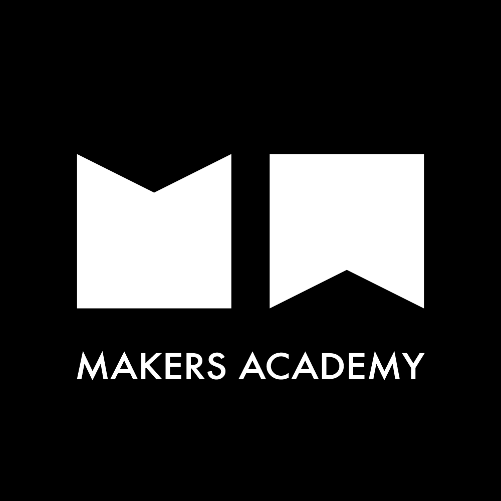

<h1></h1>
    
<h4 align="center">Email&nbsp;:&nbsp;<a href="mailto:carlton.anand@gmail.com">Carlton Anand</a>&nbsp;&nbsp;&nbsp;&nbsp;&nbsp;</h4>
  
<!-- 

 -->

# Carlton Anand

<!-- # Carlton Anand    -->

<!-- 

 -->

I have a degree in Civil Engineering and worked at Merrill Lynch investment bank for 4 years providing second line application support for traders in Fixed Income Currencies and Commodities section.  The role provided me the opportunity to use my `problem solving`, `communication` and `organisation` skills in a fast-moving dynamic setting.  This experience triggered my interest in software development, so I re-trained in software development by attending a boot camp with Makers and am very keen to apply my learning and further develop in the workplace.

**Please expand the drop downs below by clicking on them**

Skills

|  Ruby |  JavaScript |  C# |
| :---: | :---: | :---: |
| Gems, Rails, Sinatra, Rspec, Capybara | Vanilla, React.js, jquery, Node.js | Using C# to hold data and interact with the Unity Game Engine,  |

 

|  Github |  Unity|   |
| :---: | :---: | :---: |
| Git command line, Markdown, Repo collaboration, Merge conflicts, Work flows (branching) | Mobile application and Game Development, specifically Virtual Reality |

 

Projects

| Link | Summary | Technologies used |
| :---: | :---: | :---: | :---: |
| [VR-Hide-And-Go-Beetroot](https://github.com/Carlton7/vr-hide-and-go-beetroot) | A virtual reality game where you'll have to navigate a random procedurally generated maze (using the hunt and kill algorithm) to find the Beetroot before the time runs out. | C# and Unity Game Engine |
| [Acebook](https://github.com/Carlton7/acebook-rails-amoeba-boyz) | A team project aimed to make a Facebook clone. | Ruby, Rails, CSS, Heroku |
| [Bank Tech Test](https://github.com/Carlton7/Bank_Tech_Test) | An individual challenge to practice coding under pressure and writing clean code that would be worthy of passing a tech test. | Javascript, Jasmine testing framework |

<!--
| [ReciPeeps](https://github.com/fo0s/ReciPeeps) |  Makers final project. As a team, we were tasked with making a personal development application. We came up with Recipeeps, a social place where people can post recipes, have them voted up by popularity and eventually build up their own personal cookbook that can be printed and sent as a physical object. | Ruby, Rails, CSS, Heroku, Javascript, Travis |
| [Algorithm Complexity](https://github.com/fo0s/AlgorithmComplexity ) | My personal playground to replicate and understand how methods are build and tweaked to get the best possible result. | Ruby, [Time complexity theories](https://en.wikipedia.org/wiki/Time_complexity) |
-->

Education

### Makers Academy (April 2019 - Present)

> Makers Academy is a computer programming boot camp in London. 
> It was founded by Rob Johnson and Evgeny Shadchnev in December 2012
> and is designed to turn people with no knowledge of web development 
> into job-ready junior developers.

- Learning to learn fast: Be it with programming languages, methodologies or effective collaborations (TDD/BDD, OOP)
- Problem solving: Individually, as a pair or as a group. Encouraging feedback and sharing learnings
- Agile and XP values, scrum methodology, pair programming. Respecting my pair partners/team mates, having the courage to give feedback. To communicate and keep things simple keeps the team efficient.

- Technologies learnt; 
    -C#
    -Ruby 
    -JavaScript 
    -Rails 
    -RSpec 
    -Sinatra 
    -Capybara 
    -Jasmine 
    -Unity Game Engine
    -PostgreSQL

### Civil Engineering 2:1 - UWE Bristol (2010 - 2013)

Experience

#### Bank of America Merrill Lynch (BAML), London, UK.

> Sep, 2014 — Aug 2018

*Assistant Vice President*
Contractor then AVP at the EMEA Counterparty Portfolio Management (CPM) Support team.

- Provided 2nd line support for CDM and xVA applications (CVA, FVA, KVA) and helped
onboard new apps from start to finish. 
- Implemented a new change/release management system for all apps within the CPM
space, while also introducing stricter release windows. This and adding greater
responsibility to the requestor meant we dealt with less emergency releases.
- Attained successful DR certificates for a variety of applications, this includes both weekend and seven-day certifications.
- Setting up a visual dashboard via ITRS to provide monitoring for the support team.
Using the tool, we were able to visualise such things as: application batches,
infrastructure, missing data and SLA breaches.
- Established and set up a new ticketing system for all apps, to manage/track time
spent on certain tasks. Also using this to improve our communication and data logging
during emergency procedures.

#### BLADEROOM, Cheltenham, UK.

> Dec, 2013 — Jul, 2014

*Sales Engineer*
Worked with the sales and technical teams in the business, helping deliver and maintain modular data centres to places such as: UK, Australia, Nigeria, USA and South Africa.

- Writing proposals and tenders for various clients 
- Acting as a representative/technical consultant at various sites around the UK for BladeRoom.

#### BUOTC, Bristol, UK.

> Sep, 2012 — Jul, 2013

*Officer Cadet*
Selected to attend the training program at the Bristol University Officers Training Corps (BUOTC), which develops Leadership and Teamwork Skills while offering an understanding of an Officers role in the Army. The program involved travelling to Wales, Scotland and Cyprus to use the army’s facilities and camps.

When I'm not programming

I like to compete and participate in many sports/outdoor activites. Played Cricket for 18+ years at a representative level in Sydney, London and for the MCC, winning individual honours and premierships. Also a compentent football, sqaush and table tennis player.

